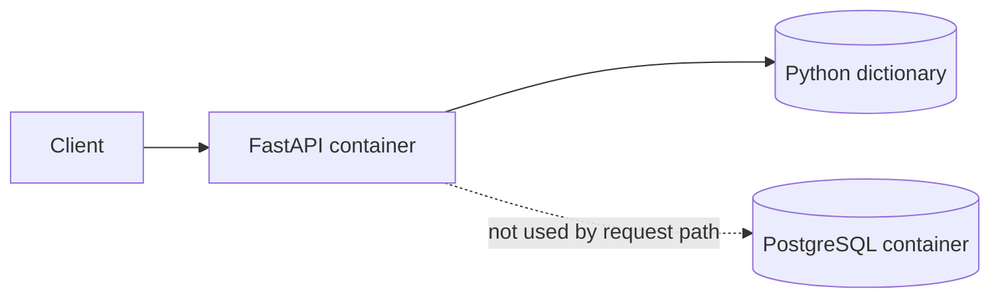
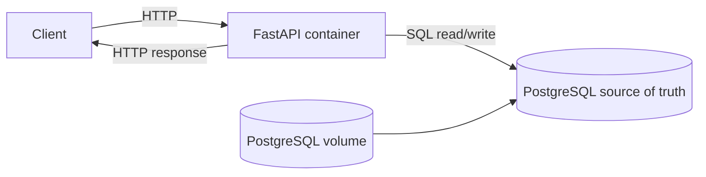
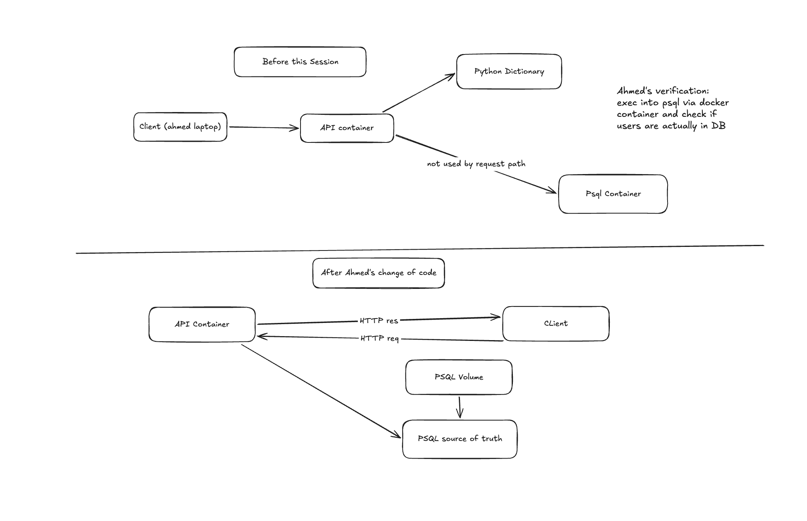
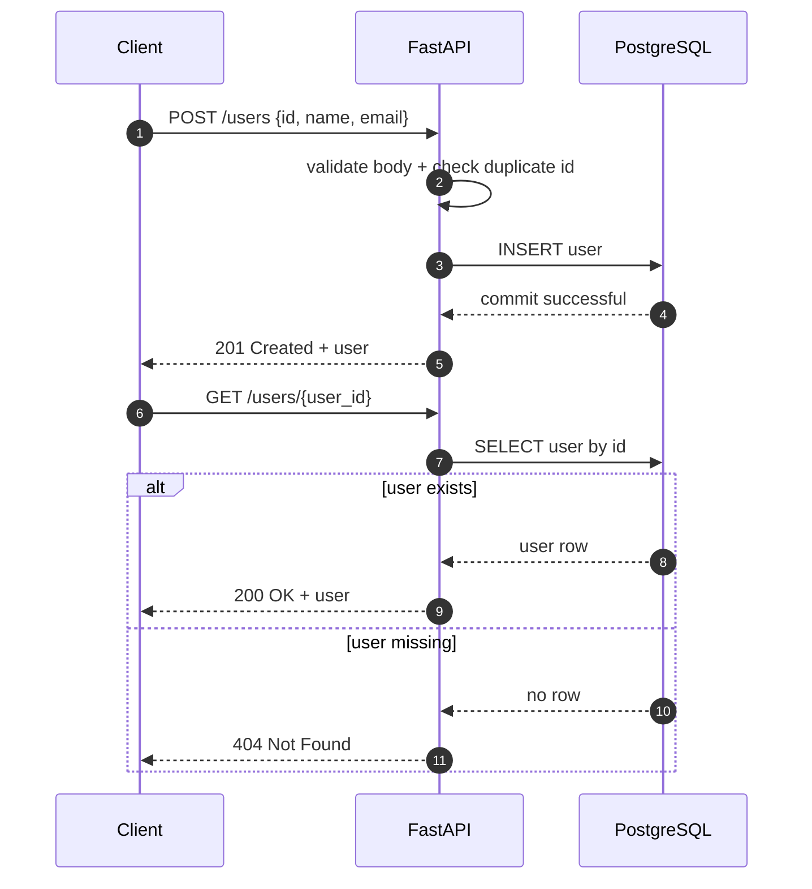

# Session 3: durable state

## The observation that motivated this

```text
POST /users → restart the API container → GET /users/{id} → 404
```

Session 2 stored users in a process-local dict, so the data's lifetime was the process's lifetime.
The property we were missing is **durability**, not scalability and not authorization.

Postgres was already running in Compose and it did not save a single request, because nothing in
the app ever wrote to it. Infrastructure is not part of the application flow until code uses it.

## Architecture, before and after

Before this session, Postgres existed in the topology but nothing called it:



After it, Postgres is on the request path and the volume is what makes the data outlive the
container:



The whiteboard version from the session, including how we verified the rows really landed:



The difference worth naming out loud: Postgres did not change. What changed is that the
application talks to it.

## Request flow



On step 2, validation splits in two once storage moves. Shape and types are still checked in the
API by Pydantic, but the duplicate `id` check is now the primary key doing it, and the API turns
the resulting error into a 400. Reading first to see whether the id exists would be a race: two
requests can both read "not there" before either writes.

## What we built

- `users` table in Postgres: `id BIGINT PRIMARY KEY`, `name TEXT NOT NULL`, `email TEXT NOT NULL`.
  One user is one row. Created on startup with `CREATE TABLE IF NOT EXISTS`.
- Replaced every dict read and write in `../app/main.py` with SQL against Postgres.
- `DATABASE_URL` env var, set in `../docker-compose.yml` (`db` is the Compose service name).
- A connection pool opened at startup, and one connection, meaning one transaction, per request.
- The API now waits for Postgres to accept connections before it serves, via a Compose
  healthcheck plus a pool that retries.

The external API contract did not change. Same five endpoints, same status codes, same error
messages as session 2. Storage moved; the client cannot tell.

## Why these decisions

- **Postgres, not SQLite, not a new dependency.** The smallest change that satisfies durability was
  wiring up the service that was already in the topology.
- **`RETURNING` on every write.** Each statement returns the row it actually touched, so the
  response body is what Postgres stored rather than what the request asked for. If Postgres is the
  source of truth, the response has to come from Postgres.
- **`BIGINT`, not `INTEGER`.** `INTEGER` is 4 bytes, so an id above 2147483647 would be a 500. The
  dict never had that limit and the API contract should not gain one by accident.
- **No `UNIQUE` on email.** Session 2 allowed two users to share an email. Adding the constraint
  here would have been a silent contract change. Duplicate handling is session 4's topic.
- **Credentials in a committed `.env`.** They are fake and local-only, and committing them keeps
  `docker compose up` working on a fresh clone. The point is that the password exists in one place
  rather than in both the db container and the API's DSN, where the two can drift.
- **A pool, not a connect per request.** A connect per request pays a TCP and auth handshake every
  call. The pool is also the natural place to make startup wait for Postgres.

## What "commit" means here

`with pool.connection() as conn:` opens a transaction. Statements inside it are invisible to
everyone else until the block exits and commits. If the handler raises, the block rolls back and
nothing was written. That boundary is why a half-finished write cannot be read by someone else.

## The new failure mode we introduced

Durability is not availability. The API now has a network dependency it did not have in session 2:

```bash
docker compose stop db
curl -i localhost:8000/users/123   # fails now, where session 2 answered from memory
```

Session 2's version could not lose data because it never had any. This version can be unable to
reach its data. That is a trade we made deliberately, and it is what motivates later sessions on
replicas, retries, and health checking.

## Try it

See [`../app/README.md`](../app/README.md), including the "Prove it persists" section.

## Open questions for next session

- `PUT` answers 404 before 400 when the user is missing and the body id mismatches. Which should
  win, and why?
- Should two users be allowed to share an email? If not, which status code, and what error body?
- Should `PUT`/`PATCH` require auth, the question session 2 left open?
- `scripts/prove-persistence.sh` checks durability and nothing else. There are no tests for the
  endpoint contract itself, so every status code above is still verified by hand.
