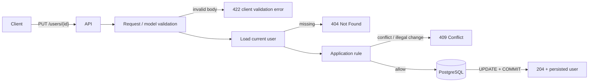
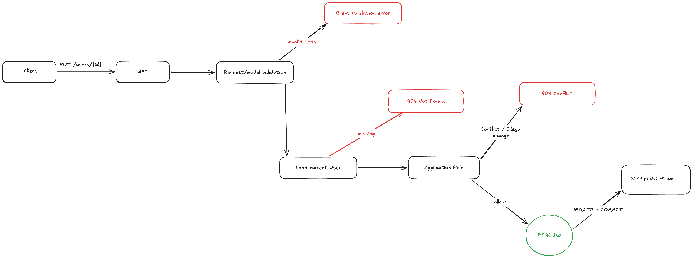
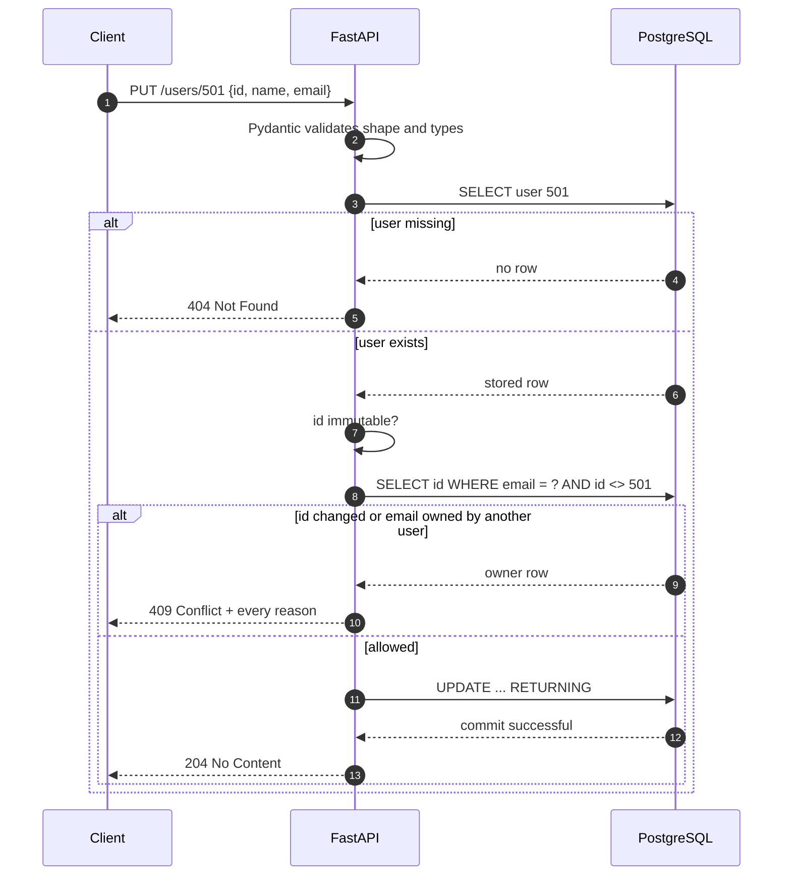

# Session 4: error contracts

## The observation that motivated this

Session 3 left `PUT` answering two different questions with the same shrug:

```bash
# body id disagrees with the path
curl -i -X PUT localhost:8000/users/501 -H 'content-type: application/json' \
  -d '{"id":777,"name":"a","email":"a@coderco.io"}'          # 400

# email already belongs to user 502
curl -i -X PUT localhost:8000/users/501 -H 'content-type: application/json' \
  -d '{"id":501,"name":"a","email":"b@coderco.io"}'          # 200, duplicate lands
```

The first is a 400, which tells the client "your request is malformed" when the request is perfectly
well formed and simply disagrees with what the server holds. The second is not caught at all.

The property we were missing is a **truthful error contract**: a status code that tells the client
what kind of thing went wrong and whether retrying could ever help. Durability was session 3's
subject and it is not affected by any of this. A service can be perfectly durable and still lie
about why it said no.

## The flow we drew



The whiteboard version from the session:



Three rejection gates, in a fixed order, each answering a different question:

| Gate | Question | Needs the DB? | Status |
|---|---|---|---|
| Request / model validation | is this a user-shaped body? | no | 422 |
| Load current user | does the target exist? | read | 404 |
| Application rule | may this change be made? | read | 409 |

The order is the interesting part, not the codes. Each gate needs the previous one to have passed:
you cannot apply a rule to a user you have not loaded, and you cannot load a user from a body you
cannot parse. That is why 404 beats the id check, which answers session 3's open question of which
should win.

## Request flow



On step 2, validation now splits three ways rather than two. Pydantic still owns shape and types.
Existence is a `SELECT`. And a third category appears that neither of those can express: changes
that are individually well formed and refer to a real user, but are not allowed given what is
already stored. That category is what 409 is for.

## What we built

- `_reject_conflict` in `../app/main.py`, the application-rule gate. Two rules:
  - `id` is immutable, so a body id that differs from the stored id is rejected rather than
    silently ignored.
  - `email` may not be one another user already owns.
- Both rules are evaluated and **all** reasons are returned in one 409, rather than failing on the
  first. A client fixing one problem should not have to make another round trip to discover the
  second.
- `PUT` success became **204 No Content**. The response body was a copy of what the client just
  sent, so it carried no information the client did not already have.
- Collection endpoints landed alongside: `GET /users` and `DELETE /users` (admin only).

## Why these decisions

- **409, not 400.** 400 means "I could not understand you". 409 means "I understood you, and it
  conflicts with what I have". They imply different client behaviour: a 400 is fixed by changing the
  request, a 409 may be fixed by changing the request *or* by the conflicting state going away.
  Collapsing them costs the client that distinction.
- **404 before the rule.** The rule needs the stored row to decide anything. Ordering the gates by
  what each one requires makes the ordering a consequence rather than a preference.
- **All reasons, not the first.** Fail-fast validation turns one bad request into N round trips.
- **204, not 200 + body.** If the client sent the full representation and the server stored it
  unchanged, echoing it back is a copy of the request. The interesting confirmation is the status
  code and, if the client actually wants the stored state, a subsequent `GET`.
- **`RETURNING` kept even though the body is dropped.** The row is not returned to the client, but a
  zero-row `UPDATE` is still the difference between "changed" and "silently matched nothing".
- **`ORDER BY id` on `GET /users`.** An unordered `SELECT` is not required to be stable across
  calls; a list endpoint that reshuffles is a nasty thing to debug. Still no `LIMIT`: pagination is
  its own session, and the response grows with the table until then.
- **`rowcount`, not `len(fetchall())`, to count a bulk delete.** Carrying every deleted id back from
  Postgres to take a length is the habit this series exists to notice.

## What the database would have done instead

Worth walking through, because the intuition that "the database will catch it" is mostly wrong here.
Drop `_reject_conflict` and there are three outcomes, not one.

**The id case: silent success, and no constraint can help.** The statement is

```sql
UPDATE users SET name = %s, email = %s WHERE id = %s
```

`id` appears only in the `WHERE`. Postgres reports `UPDATE 1` because it was never asked to change
an id. The primary key stops two rows sharing an id; it has no view on a client's stated intent
being discarded. Under 204 there is not even a response body for the client to notice the
disagreement in, which is precisely why the rule gate has to exist.

**The email case on today's schema: also silent success.** There is no `UNIQUE` on `email`, so
Postgres has no opinion. A database does not object to duplication in general, only to violating a
constraint you declared.

**The email case with `UNIQUE (email)`: an error, but the wrong one.**

```text
ERROR:  duplicate key value violates unique constraint "users_email_key"
DETAIL:  Key (email)=(b@coderco.io) already exists.
```

That is SQLSTATE `23505`, which psycopg raises as `UniqueViolation`. Unhandled it propagates, the
`with pool.connection()` block rolls back so nothing is written, and FastAPI turns it into **500
Internal Server Error**. The database returned *an* error, not a *409*: `23505` is a Postgres error
class and 409 is an HTTP status, and nothing converts one into the other for free. A 500 tells the
client "the server is broken, retry later" when the truth is "retrying will never help".

`create_user` already does that translation for the primary key:

```python
except UniqueViolation:
    raise HTTPException(status.HTTP_400_BAD_REQUEST, f"user {user.id} already exists") from None
```

Which leaves the honest comparison:

| | catches id case | catches duplicate email | race-safe | client sees |
|---|---|---|---|---|
| No rule, no constraint | no | no | — | 204, wrong data |
| No rule, `UNIQUE` | no | yes | yes | 500 |
| Rule only, what we built | yes | sequentially | **no** | 409 |
| Rule + `UNIQUE` + translate | yes | yes | yes | 409 |

## The new failure mode we introduced

The email rule is a read-then-write:

```python
owner = conn.execute(EMAIL_OWNER, (incoming.email, current.id)).fetchone()
if owner is not None:
    ...
```

Two concurrent PUTs can both read "that email is free" before either writes, and both then write.
The rule closes the sequential case only. This is the same race session 3 named when it refused to
check for a duplicate id before inserting, arriving a second time at `UPDATE`.

So the four-row table above is not academic. The last row is the real design: the constraint is the
only mechanism that is actually atomic, the application rule is the only one that produces a decent
message and catches the id case, and the `except UniqueViolation` translation is what stops the
atomic mechanism from surfacing as a 500. We have one of the three.

## Try it

```bash
A=http://localhost:8000; h='content-type: application/json'
curl -s -X POST $A/users -H "$h" -d '{"id":501,"name":"a","email":"a@coderco.io"}'
curl -s -X POST $A/users -H "$h" -d '{"id":502,"name":"b","email":"b@coderco.io"}'

curl -i -X PUT $A/users/501 -H "$h" -d '{"id":"nope"}'                                    # 422
curl -i -X PUT $A/users/999 -H "$h" -d '{"id":999,"name":"x","email":"x@coderco.io"}'      # 404
curl -i -X PUT $A/users/501 -H "$h" -d '{"id":777,"name":"a","email":"a@coderco.io"}'      # 409
curl -i -X PUT $A/users/501 -H "$h" -d '{"id":501,"name":"a","email":"b@coderco.io"}'      # 409
curl -i -X PUT $A/users/501 -H "$h" -d '{"id":777,"name":"a","email":"b@coderco.io"}'      # 409, both reasons
curl -i -X PUT $A/users/501 -H "$h" -d '{"id":501,"name":"a2","email":"a2@coderco.io"}'    # 204
curl -s $A/users/501                                                                       # Postgres holds the new values
```

The pair to watch is the last two: 204 with no body, then a `GET` proving the write landed. "204 +
persisted user" is two claims, and only one of them is visible in the response.

The rule-less version is still running next door, if you want to see it fail:

```bash
curl -i -X PATCH $A/users/501 -H "$h" -d '{"email":"b@coderco.io"}'   # 200, duplicate lands
```

## Open questions for next session

- `PATCH` has no rule gate, so it accepts a duplicate email that `PUT` rejects. One resource, two
  contracts. Does the rule belong on the endpoint or on the resource?
- `UNIQUE (email)` plus `except UniqueViolation` → 409 would close the race. That is a schema
  change on a table that currently holds duplicates, so it needs a migration and a decision about
  the existing rows. What runs the migration?
- Every status code in this session was verified by hand or by `curl`. Session 3 said the same thing
  about its own. The endpoint contract still has no automated tests, and it now has ten branches.
- `GET /users` is unbounded. At what row count does that stop being fine, and what does the client
  do with a response that large?
- Do `PUT`/`PATCH` require auth? Session 2 asked, session 3 repeated it, still open.
