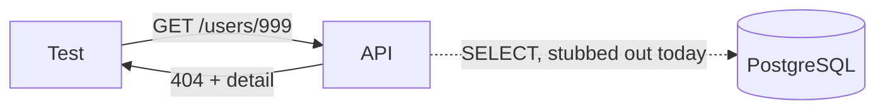
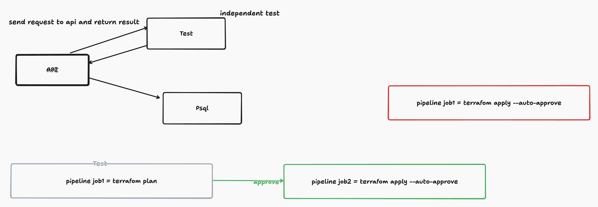
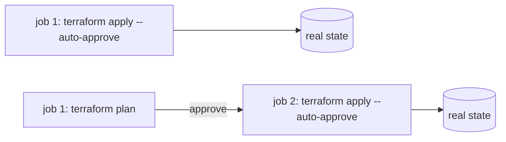

# Session 5: verifying the outcome

## The observation that motivated this

Session 4 closed with ten branches through the endpoint contract and this admission:

> Every status code in this session was verified by hand or by `curl`. Session 3 said the same thing
> about its own. The endpoint contract still has no automated tests, and it now has ten branches.

Hand verification has a specific failure mode, and it is not "someone is lazy". A `curl` proves the
contract held at the moment you ran it, on the machine you ran it on, against the state that
happened to be in the database. It proves nothing about the next change. Session 4 introduced three
rejection gates in a fixed order; nothing in the repository would notice if a later edit reordered
them, and the person most likely to reorder them is the person who wrote them, six weeks later.

The property we were missing is a **check that outlives the session that wrote it**.

## The flow we drew



The whiteboard version from the session:



Two halves, and the second is the reason the first matters.

The left half is the test's position: **outside** the API, sending a real request and reading the
real result. It does not import `_user_or_404` and call it with a `None`. It asks the question a
client asks, over the interface a client uses, which is the only way a test can be evidence about
the contract rather than about the internals.

The right half is the same idea in infrastructure terms:



The red path applies straight to real state. The green path computes the outcome first, shows it to
someone, and only then applies. `plan` is not a safety ritual, it is the same move as a test: it
produces the outcome **before** the outcome is real, while changing your mind is still free. A repo
with no tests is the red box, and the fact that it has usually been fine is not evidence that it is
safe, only that nobody has looked.

## What we built

One test, and the smallest amount of scaffolding that lets it run anywhere.

- `../tests/test_users.py`, a single case: `GET /users/999` returns `404` and
  `{"detail": "user 999 not in DB"}`. Status **and** body, because the status alone would pass for a
  404 raised by a typo in the route path.
- `../conftest.py`, which sets `DATABASE_URL` before `app.main` is imported. The module reads it at
  import time and fails fast without it.
- `../pytest.ini`, pinning `testpaths` and `pythonpath` so rootdir resolves to the repo root however
  pytest is invoked.
- `../requirements-dev.txt`, the test-only dependencies, kept out of the runtime image.

The connection is supplied by overriding the `get_conn` dependency with an object whose queries
match nothing:

```python
class NoRowsConn:
    """A connection whose queries match nothing, the state a 404 is read from."""

    def execute(self, *_args):
        return self

    def fetchone(self):
        return None
```

## Why these decisions

- **One test, not ten.** The first test's real job is to make the second one cheap. Almost all the
  cost here was scaffolding — import path, env var, rootdir, the HTTP client — and that cost is paid
  once. Writing ten now would also mean rewriting ten when the next section changes how tests reach
  the database.
- **The 404 first, of the ten branches.** It needs no fixture, no seeded row, and no cleanup. A test
  that starts by creating state is a test that can fail because the *previous* run left something
  behind, and diagnosing that on your first test teaches you nothing about the contract.
- **Status and body, not just status.** `assert response.status_code == 404` passes if the route
  disappears entirely, because FastAPI answers an unrouted path with 404 as well. Asserting the
  detail string is what distinguishes "the handler decided this" from "nothing handled it".
- **A stubbed connection, not a live Postgres.** The 404 is decided by a query returning no row.
  The override supplies exactly that, so the test runs in 0.13s with nothing else up. The cost is
  stated plainly in the next section rather than hidden.
- **`TestClient(app)` outside a `with` block.** Starlette runs the lifespan on `__enter__`. Kept out
  of the context manager, `pool.open(wait=True, timeout=30)` never fires, so a test run does not
  need — or wait 30 seconds for — a database.
- **`httpx2`, not `httpx`.** Starlette's TestClient emits `StarletteDeprecationWarning: Using httpx
  with starlette.testclient is deprecated; install httpx2 instead`. Taking the rename now costs one
  line in a file nothing else depends on.
- **`pytest.ini` rather than nothing.** Without it, pytest run from inside `tests/` sets rootdir to
  `tests/`, which puts the root `conftest.py` outside confcutdir so it never loads, and the run dies
  on `ModuleNotFoundError: No module named 'app'`. The config makes rootdir a property of the repo
  instead of a property of your shell's current directory.

## We watched it fail before we believed it

A test that has only ever passed is not yet evidence. It could be asserting nothing, be pointed at
the wrong process, or be silently skipped. So we broke the behaviour on purpose:

```python
raise HTTPException(status.HTTP_410_GONE, f"user {user_id} not in DB")
```

```text
>       assert response.status_code == 404
E       assert 410 == 404
FAILED tests/test_users.py::test_get_missing_user_returns_404 - assert 410 == 404
```

Then reverted, and watched it pass again. This is the same instinct as `scripts/prove-persistence.sh`
in session 3: the check has to be able to fail, or it is decoration. It is also `terraform plan`
again — the value is in seeing the outcome you did not want *before* it is real.

## What this test does not prove

Worth being exact, because a green test tempts you to claim more than you bought.

| Claim | Covered? |
|---|---|
| A missing user answers 404 with that detail | yes |
| The `SELECT` in `_get_user_or_404` is correct SQL | **no** — Postgres never runs |
| The other nine branches (201, 200, 204, 422, 409, 400, 401, 403) | **no** |
| The startup path: pool opens, `CREATE TABLE IF NOT EXISTS` runs | **no** — lifespan is skipped |

Nothing runs this automatically either, and that is a decision rather than a gap. This repo is the
series' worktable, not a deployed service, so a pipeline here would be infrastructure appearing
because the diagram has one — the exact move the core principle in `../README.md` exists to refuse.
The pipeline half of the drawing earns its place as the analogy that explains why a verify gate
matters, not as a backlog item. `pytest -q` before you commit is the gate this repo needs.

## Try it

```bash
python3 -m venv .venv
source .venv/bin/activate
pip install -r requirements-dev.txt

pytest -q                                                        # 1 passed in 0.13s
pytest tests/test_users.py::test_get_missing_user_returns_404 -v  # just this one
```

Watch it fail, which is the part worth doing by hand: change `HTTP_404_NOT_FOUND` to
`HTTP_410_GONE` in `_user_or_404` in `../app/main.py`, run `pytest -q`, and put it back.

One gotcha that cost us minutes in the session. It is `-m pytest`, never `-m test`:

```bash
python -m test     # CPython's own stdlib suite, 492 tests, minutes
python -m pytest   # this repo's tests, 1 test, 0.13s
```

`test` is a real module in the standard library, so the typo does not error. It prints
`Run 492 tests sequentially in a single process` and starts grinding through CPython.

## Open questions for next session

- The test does not touch Postgres, so it cannot catch a broken `SELECT`. Do we bring the database
  into the test (testcontainers, or the Compose stack), or keep tests fast and stubbed and accept
  that SQL is only exercised by hand? The diagram says "independent test", and a stub is arguably
  not independent of the code it stands in for.
- Nine branches remain. Which are worth a test, and does test count belong in a session at all, or
  is "every branch has one" the wrong target?
- Carried over, still open: `PATCH` has no rule gate; `UNIQUE (email)` plus a translated
  `UniqueViolation` would close session 4's race but needs a migration; `GET /users` is unbounded;
  and whether `PUT`/`PATCH` require auth, asked in session 2 and unanswered since.
