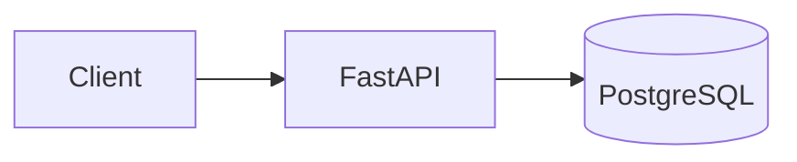
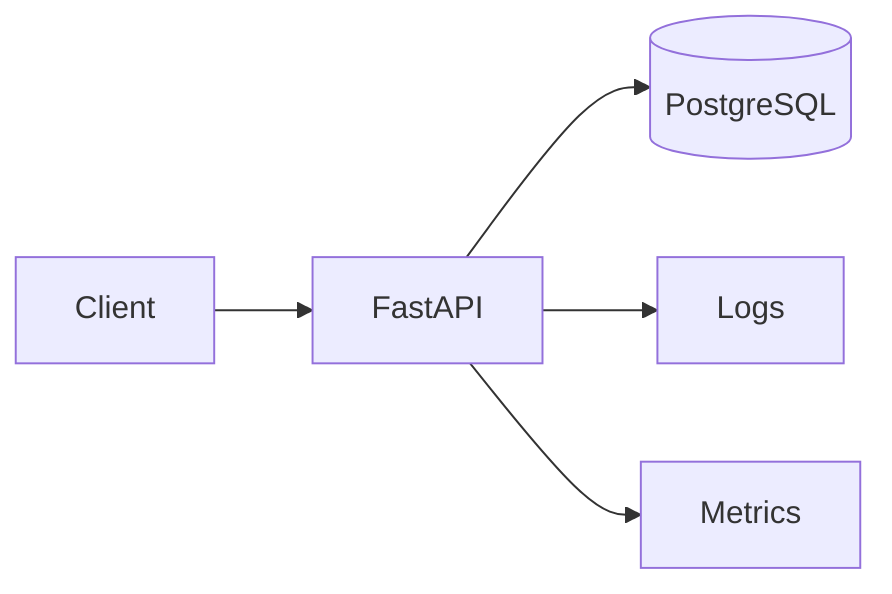
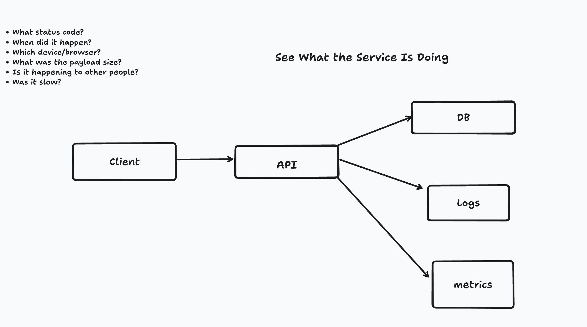
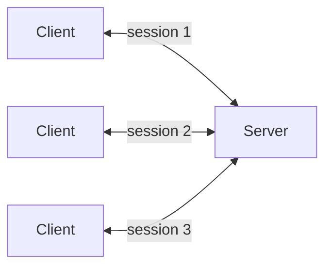
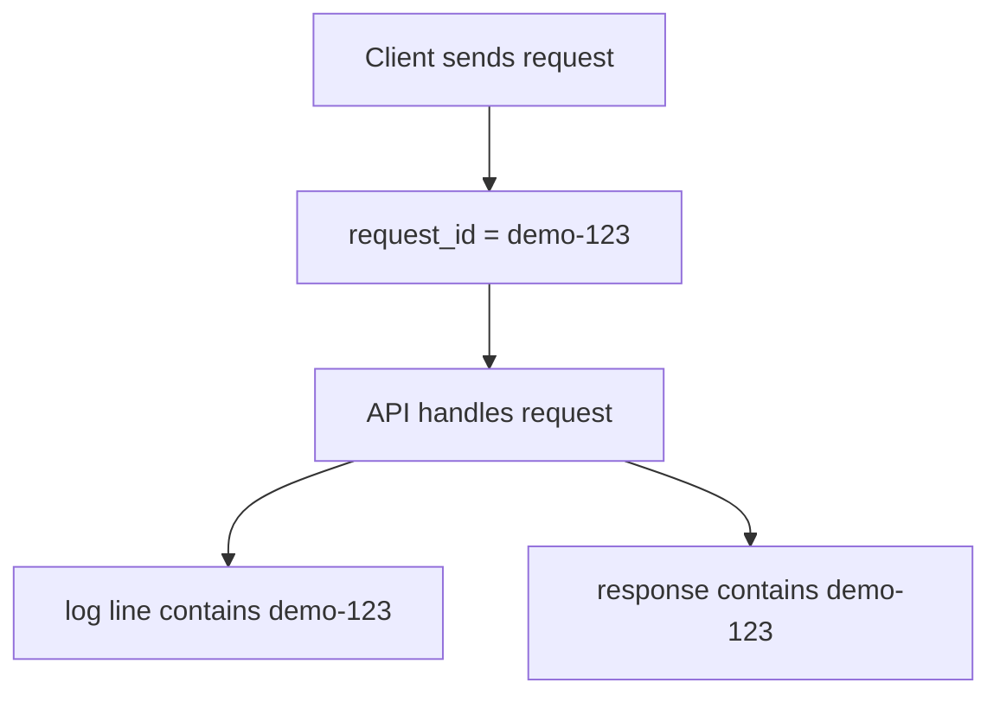

# Session 6.1: request IDs, before logs and metrics

## The observation that motivated this

Session 5 gave us a test that outlives the person who wrote it. It answers "does the contract
still hold" for one known request, sent by us, at a time we chose. It says nothing about a request
we did not send.

Put the service in front of real traffic and the question changes. A `curl` to `/users/999999`
returning 404 tells us the API understood the request and could not find that user — a 404 is not
the API being down. But at 1,000 requests a minute, "the API answered wrong for someone at 10:05pm"
is not a question `pytest` or `curl` can answer after the fact. We do not have the request anymore.
We only have a description of it.

The property missing this session is not correctness, it's **the ability to point at one request,
after it has already happened.**

## The flow we drew

The system itself hasn't changed:



What changes is what the API leaves behind when it handles a request:



The whiteboard version from the session:



Logs and metrics are not new business services on the diagram. The request still only travels
`client → API → database`. Logs and metrics are what the API writes down about that trip, so the
trip can be reconstructed later.

## Why "which request" is hard before you have an ID

At curl-in-a-terminal scale, "which request" is never a real question — there is only one, and it's
the one on your screen. The scale that makes it hard is ordinary production traffic: many clients,
many concurrent round trips through the same server.



A user reports a failure by description — "mine failed around 10:05pm" — not by identifier.
Nothing in the diagram above distinguishes session 1's request from session 3's once they've both
landed in the same pile of logs.

## Request IDs: the piece we introduced

A request ID (also called a correlation ID) is a unique label attached to one request, so that
request can be recognised again later — in logs, in a bug report, in a support ticket. It is not a
user ID, not an auth token, and it grants no permission; it identifies a trip through the system,
nothing else.

```text
request #1 → abc-123
request #2 → xyz-789
request #3 → qwe-456
```



Once both sides hold the same label, "find my request" stops being a fuzzy description ("around
10:05pm, on my phone, I think") and becomes an exact lookup (`grep demo-123`).

## What this session does not cover yet

Deliberately incomplete — the second half is next session.

| Question a bug report raises | Can we answer it yet? |
|---|---|
| Can we find the exact request a user is describing? | yes, once we generate and log a request ID |
| What did the API actually do while handling it? | **no** — logs not implemented yet |
| Is this one user, or is the service degraded for everyone? | **no** — no metrics yet |
| Was it slow, and is "slow" trending up? | **no** — no latency measurement yet |

## Open questions for next session

- Where does the request ID get generated — client-supplied, API-generated, or both (accept one if
  given, mint one if not)?
- What does a log line need to contain besides the request ID to be useful (timestamp, status,
  path, latency)?
- Counters vs histograms: which questions from the whiteboard bullet list need "how many" and which
  need "how long"?
- The hands-on we didn't get to: given a request ID, find that request's log line and decide
  isolated-vs-pattern.
