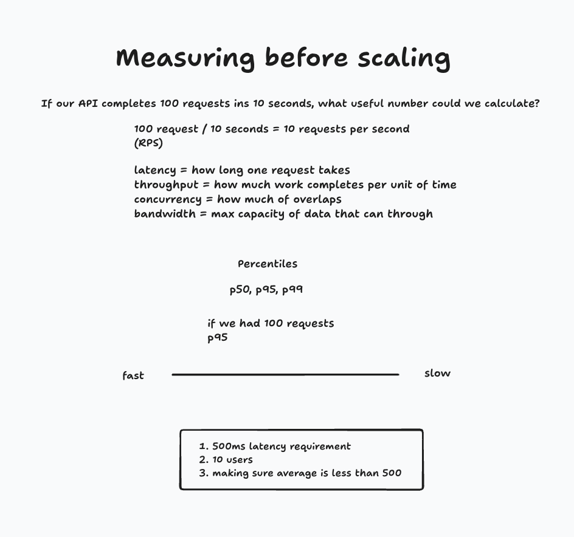

# Session 7.1 — run log: measure the single instance before scaling

What we ran, and what the numbers meant.

## Setup

One API, one Postgres, both already up:

```
api-1   uvicorn app.main:app   Up 7 days   :8000
db-1    postgres:16-alpine     Up 7 days (healthy)   :5432
```

Path unchanged: **one API → one Postgres**. We only put it under load with
`tools/load_test.py` and read three numbers: **RPS, p50, p95**.

## Terms (whiteboard)



- **latency** — how long one request takes.
- **throughput (RPS)** — requests completed per second.
- **concurrency** — how many overlap at once.
- **p50 / p95** — median, and the slow end. With 100 requests, p95 = the 95th-slowest.
- **Target:** p95 under **500 ms**. Judge the slow end, not the average.

## Runs

**1. `/users/501` → all "failed", but fast**

```
--requests 100 --concurrency 1
successes: 0   failures: 100   RPS: 214.5   p50: 3 ms   p95: 7 ms
```

`501` doesn't exist → 404. The tool counts non-2xx as a failure but still times it. Fast 100%
failure = server healthy, user absent. A 404 is not the API being down.

**2. `/users/123` → baseline**

```
--requests 100 --concurrency 1
successes: 100   RPS: 226–248   p50: 3 ms   p95: 5–8 ms
```

One caller, no overlap: ~3 ms typical, well under 500 ms.

**3. Add overlap → more throughput, more latency**

```
--requests 300 --concurrency 1     RPS: 259.5   p50: 3 ms    p95: 6 ms
--requests 300 --concurrency 10    RPS: 417.1   p50: 20 ms   p95: 45 ms
```

10× overlap → ~1.6× throughput, p95 6 → 45 ms. Still 100% success, still under budget. The trade:
concurrency buys throughput by making each request wait.

**4. Too much overlap → collapse**

```
--requests 300 --concurrency 50
successes: 4   failures: 296   RPS: 5.0   p50: 10004 ms   p95: 10137 ms
```

From 100% to 4/300. Two things to explain:

- **Why ~10 s:** the tool's `--timeout` default is 10 s. The 296 failures *gave up waiting* — the
  server didn't reject them.
- **Why exactly 4 succeed:** the app's pool has no `max_size`, so psycopg defaults to **4**
  (`app/main.py:21`), and each request holds a connection for its whole handler (`get_conn`,
  `app/main.py:38`). Only 4 progress at once; the other 46 per wave queue past the 10 s timeout.

We hit **our own 4-connection pool**, not Postgres' 100 `max_connections`.

## Takeaways

- Three numbers (RPS, p50, p95) measure a single instance's limit — no scaling needed.
- Throughput and latency trade off as concurrency rises; check **p95 vs 500 ms**.
- The first wall was an **app setting (pool size 4)**, not CPU or Postgres. Measure before you scale.

## Next

- Confirm it: watch `pg_stat_activity` during `--concurrency 50`; check if requests wait on
  `pool.connection()`.
- Set `max_size` and timeouts explicitly instead of inheriting defaults:
  ```python
  pool = ConnectionPool(DATABASE_URL, open=False, max_size=..., timeout=..., connection_timeout=...)
  ```
- Find where p95 first crosses 500 ms (between concurrency 10 and 50) — that's today's real capacity.
