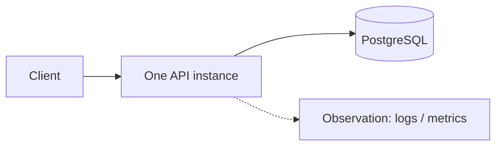
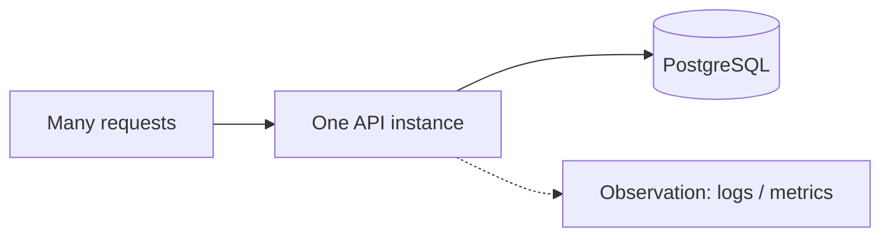
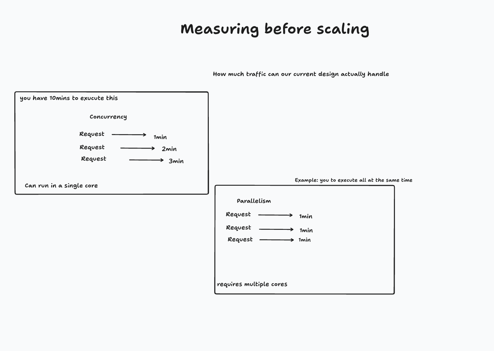

# Session 7.1: measure before you scale — concurrency, parallelism, sync, async

## The observation that motivated this

Session 6 moved us from "did my request work?" toward "what is the running service doing?" Once we
can follow one request and reason about patterns across many requests, the next move is to create
those many requests on purpose and put the **single API instance** under pressure.

```text
Session 6: What is the running service doing?
             ↓
Session 7: What happens when we put it under pressure?
             ↓
Session 8: If we need more than one instance, is one instance safe to replace?
```

The next infrastructure question is tempting: do we need more API instances, more CPU, a load
balancer, or Kubernetes? We cannot answer it yet. We have never measured how much traffic the
current design can handle, and "add more" is not a useful response until we know what the current
process spends its time doing.

> **Do not scale because a diagram says so. Measure the current design first.**

## Start from the architecture we already know

Nothing about the request path changes yet:



We evolve only the left side, from one caller to many overlapping requests:



Before running anything, the class formed hypotheses: requests might take longer, the API might
handle several at once, Postgres might get busier, requests might fail, or nothing obvious might
happen at this load. Those are all testable claims. The purpose of the session is to produce
evidence rather than argue from the diagram.

## Where session 7.1 went

We began with one familiar request:

```bash
curl -i http://localhost:8000/users/501
```

One request is easy to see as a response, a log entry, and a duration. We then asked what changes
when ten users send requests at roughly the same time. That introduced **concurrency**:

> Concurrency is the amount of work in progress at the same time. If ten requests are being
> handled at once, concurrency is roughly ten.

Concurrency is not total traffic. A client can send 1,000 requests one after another while keeping
concurrency at one. Conversely, ten overlapping requests are concurrency ten even if ten is the
only traffic the service receives.

```text
Request 1  ───────────▶
Request 2     ───────────▶
Request 3        ───────────▶

Their lifetimes overlap.
```

Asking what the room already knew about concurrency led to the next question: if requests overlap,
are they executing at the same instant? That pulled the discussion into parallelism, then into
synchronous versus asynchronous work, threads versus processes, and waiting versus computing.

Rather than rush past those distinctions into a load test, session **7.1** makes that branch
executable. The real pressure test against `/users` remains the next step.

A request can be slow for two very different reasons:

- it is **waiting** for a database, network, disk, or another service; or
- it is **working**, consuming CPU to perform a calculation.

Those cases can have the same wall-clock duration while needing different designs. The property
missing in 7.1 is a precise vocabulary and a repeatable demonstration that separates waiting from
computing before we talk about scaling either one.

## The flow we drew

The whiteboard starts with the question we have to answer before scaling:

> How much traffic can our current design actually handle?



The left side shows multiple requests sharing one core. More than one request can be **in progress**
during the same period if a request yields while it waits. The right side shows multiple requests
actually **executing** at the same instant, which requires multiple execution resources — multiple
cores for the CPU-bound example in this session.

The one-, two-, and three-minute labels are a simplified schedule, not a capacity result. The
drawing gives us the two shapes to test; only measurement can tell us their actual timings.

## Four terms that are easy to collapse into two

Sync and async describe **control flow**. Concurrency and parallelism describe **execution**. They
are related, but they are not interchangeable.

| Term | Meaning in this session | What it does not guarantee |
|---|---|---|
| Synchronous (sync) | the caller waits until the operation returns | that the whole system has only one task |
| Asynchronous (async) | a task can yield while it waits, allowing another task to progress | another thread, process, or CPU core |
| Concurrency | multiple tasks are in progress during the same period | simultaneous CPU execution |
| Parallelism | multiple tasks execute at the same instant | that the work is async or I/O-bound |

"Worker" is deliberately a generic word, so the script prints what it means in each experiment:

- In the concurrent experiment, there is **one process and one main thread**. The three units of
  work are `asyncio` tasks (coroutines), not extra OS threads.
- In the parallel experiment, `ProcessPoolExecutor` creates **three OS processes**, normally one
  main thread in each. Different PIDs make that visible.

## Experiment A: waiting work — sync versus async

The first pair gives three tasks one second of simulated I/O wait.

The synchronous baseline calls `time.sleep(1)` three times. Each call blocks the main thread, so
the next task is not started until the previous wait is over:

```text
SYNC / sequential  [task 1 WAIT] -> [task 2 WAIT] -> [task 3 WAIT]
```

The asynchronous version starts three coroutines. `await asyncio.sleep(1)` pauses one task and
returns control to the event loop, which can start another task on the **same thread**:

```text
ASYNC / concurrent  [task 1 WAIT]
                    [task 2 WAIT]  <- same time window
                    [task 3 WAIT]
```

The result is approximately three seconds versus one:

| Mode | Process / thread | CPU activity | Approximate elapsed time |
|---|---|---|---|
| Sync, sequential | one / one | mostly idle | 3 seconds |
| Async, concurrent | one / one | mostly idle | 1 second |

This is not three calculations happening simultaneously. `sleep` performs almost no calculation;
it represents time in which a real request might be waiting for Postgres or an HTTP response. The
speed-up comes from using that otherwise-idle time to keep other requests moving.

## Experiment B: CPU work — sequential versus parallel

The second pair replaces waiting with a deliberately expensive prime-counting loop. There is no
`await` inside that loop and no idle time for an event loop to reuse.

With one process, each calculation finishes before the next starts:

```text
SYNC / sequential  [task 1 WORK] -> [task 2 WORK] -> [task 3 WORK]
```

The parallel version assigns one calculation to each child process:

```text
PARALLEL  pid A  [task 1 WORK]
          pid B  [task 2 WORK]  <- same time window
          pid C  [task 3 WORK]
```

The exact duration depends on the machine. The evidence is not a promised speed-up number; it is
the combination of different PIDs, overlapping start/end intervals, and a shorter measured wall
time on a machine with multiple available cores. Process startup and scheduling overhead are why
three processes do not necessarily produce an exact 3x improvement.

Making the prime-counting functions `async` would not create parallelism. Without a point that
yields, one CPU-bound coroutine keeps the event-loop thread busy. This example uses processes so
the operating system can schedule the calculations on different cores.

## Why there are two sequential baselines

The earlier output showed two sequential sections with similar timings, which made them look
duplicated. They are controls for two different experiments:

| Baseline | What the thread does during each second | Compare it with |
|---|---|---|
| Sequential waiting | paused; the CPU is mostly idle | async concurrency |
| Sequential CPU work | calculates continuously; one core is busy | process parallelism |

The similar wall time is intentional. It shows why latency alone is not enough: three seconds of
waiting and three seconds of computing require different changes.

## What this means for measuring a service

Before changing the architecture, measure at least these four things together:

| Measurement | Question it answers |
|---|---|
| Latency | how long does one request take, including wait time? |
| Throughput | how many requests complete per second? |
| In-flight requests | how much concurrency is the service carrying? |
| Resource utilisation | which resource saturates first: CPU, connection pool, database, or network? |

The bottleneck determines the next experiment:

- If CPU is mostly idle while requests wait, more cores may do little. Async I/O or additional
  request-handling concurrency might improve throughput, until the downstream dependency
  saturates.
- If one core is continuously busy doing request work, parallel processes or more service
  instances may improve throughput.
- If Postgres or its connection pool is saturated, adding API instances can make the bottleneck
  worse by sending it more work.

Concurrency is therefore not a capacity number, and parallelism is not automatically a scaling
plan. Both are mechanisms whose value depends on where the time goes.

## What we built

[`../scripts/concurrency-vs-parallelism.py`](../scripts/concurrency-vs-parallelism.py) is a
standalone, standard-library demonstration with two paired experiments:

1. `time.sleep()` versus `await asyncio.sleep()` for sync/sequential and async/concurrent waiting.
2. Prime counting in one process versus a `ProcessPoolExecutor` for sequential and parallel CPU
   work.

The output includes the worker type, PID, thread, elapsed time, CPU activity, and process intervals
so the conclusion does not depend on the labels alone.

## Try it

No service, database, or third-party package is required:

```bash
python3 scripts/concurrency-vs-parallelism.py
```

Read the output as two comparisons:

```text
Experiment A: SYNC / sequential  -> ASYNC / concurrent
Experiment B: SYNC / sequential  -> PARALLEL processes
```

Do not compare the async wait directly with the parallel calculation; they are intentionally
different kinds of work.

## What this session does not prove yet

This script is a controlled demonstration, not a load test of the Deployment Request Service. It
does not tell us:

- requests per second for any API endpoint;
- median or tail latency under concurrent traffic;
- whether the API process, Postgres, or the connection pool saturates first;
- how many concurrent requests cause errors or timeouts; or
- whether another API instance would improve throughput.

That boundary matters. The session gives us the vocabulary and a measurement pattern; it does not
pretend a prime-counting benchmark is evidence about the real request path.

## Open questions for next session

- Which endpoint should be the first capacity baseline: a single-row `GET`, the unbounded
  `GET /users`, or a write that includes a transaction?
- What load shape should we apply — fixed concurrency, fixed arrival rate, or both?
- Which latency percentiles and error rate make the result useful instead of reporting only an
  average?
- While load rises, what happens first: CPU saturation, exhausted database connections, database
  contention, or request timeouts?
- Once we find that limit, does increasing process count move it, and what new bottleneck appears?
