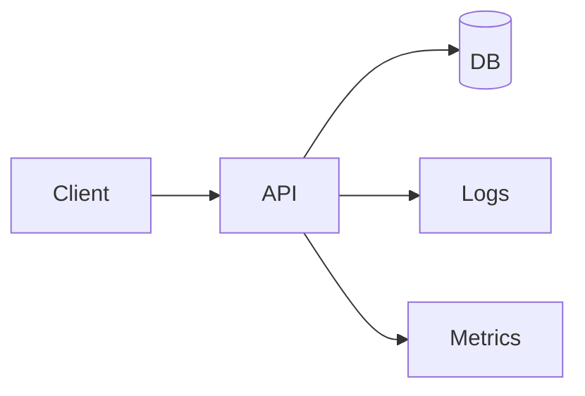
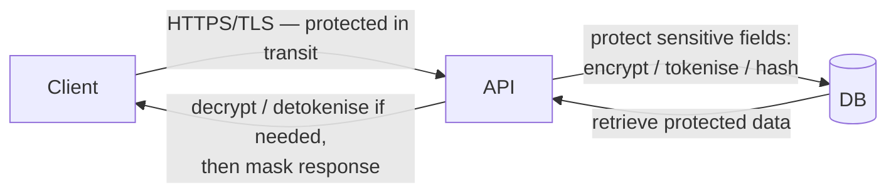
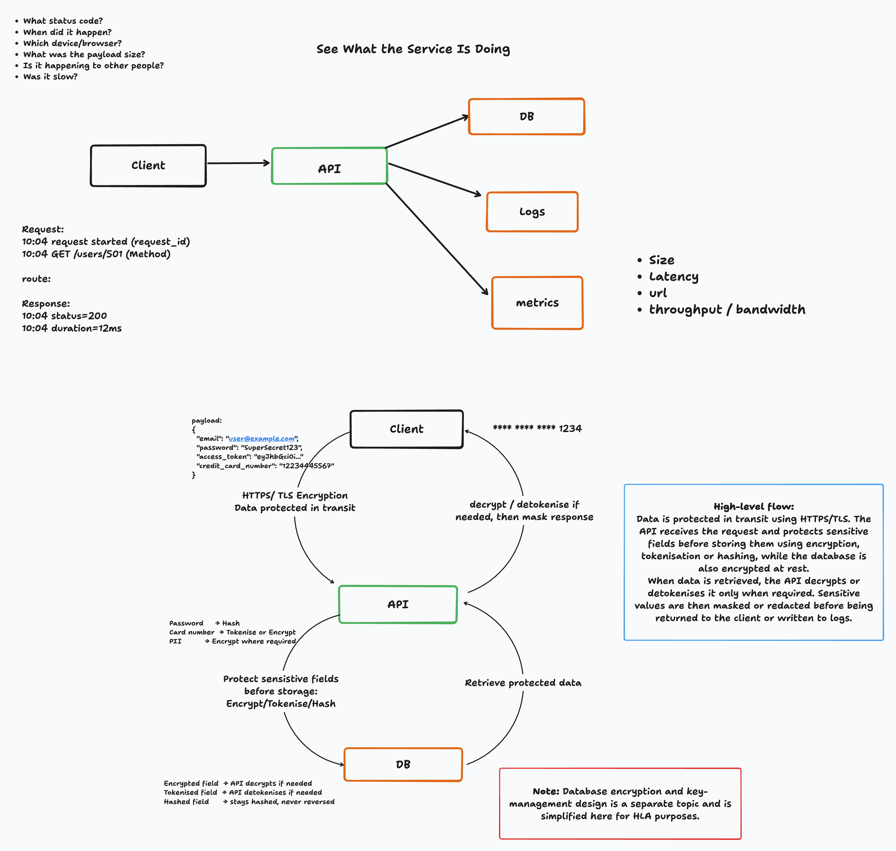

# Session 7: does the request need to contain all of it? — payload security

## The observation that motivated this

This session started as a continuation of session 6's observability thread — we were back on
"what is the service doing," walking through the whiteboard's request/response timeline (status
code, timestamp, method, duration) and the bullet list of questions a bug report actually raises:
what status code, when, which device, was it slow, is it happening to others.

One question in that list turned the session: **does the request need to contain all of it?**
Once a request can carry a password, a card number, an access token, a full PII payload, "log the
request" and "return the payload" stop being safe defaults. The session moved from *what the
service is doing* to *how a secure workflow looks at HLA* — not because we planned to cover
security this session, but because the observability question led straight into it.

## The flow we drew

Recap of session 6's shape — client, API, and the three things the API writes down about a
request:

That's the half we already had. The new half is what the API does to a payload before it reaches
any of those three destinations:

The whiteboard version from the session:

Same three boxes as every session so far — client, API, DB. Nothing new architecturally. What's
new is that the arrow between API and DB is no longer just "the payload," it's a decision per
field.

## Protecting fields before storage

The whiteboard made the point that "encrypt everything" and "log everything" are both wrong
defaults — the right operation depends on whether the field ever needs to come back out in its
original form:

| Field | On the way in | On the way out |
|---|---|---|
| Password | hash | **never** — a hash is not reversed, it's compared |
| Card number | tokenise or encrypt | detokenise / decrypt only when required |
| Other PII (email, etc.) | encrypt where required | decrypt only when required |

That last column matters as much as the first: encrypting a card number on the way in is only
half the design — the API also has to decide *when* it's allowed to bring the plaintext back, and
mask it (`**** **** **** 1234`) before it goes anywhere it doesn't need to be in full — a response
body or a log line.

## What the code proves

Two small, standalone scripts came out of this session, both under `app/security/`:

- [`data_masking.py`](../app/security/data_masking.py) — a `SENSITIVE_FIELDS` set
  (`password`, `token`, `access_token`, `authorization`, `card_number`, `cvv`) and a
  `mask_sensitive_data()` function that walks a payload and replaces any matching key's value
  before it's safe to print or log.
- [`encryption.py`](../app/security/encryption.py) — the encrypt → store → retrieve → decrypt →
  mask round trip end to end: a Fernet key encrypts a card number, the encrypted value (not the
  plaintext) is what lands in SQLite, it's read back still encrypted, decrypted only inside the
  application, and masked before being printed as what a user or log line would actually see.

Neither script is wired into the FastAPI app yet — they're proofs of the mechanism (hash vs.
tokenise vs. encrypt, and mask-before-output), not yet a middleware or model change on the running
service.

## High-level flow

The summary that came out of the whiteboard, as one paragraph:

> Data is protected in transit using HTTPS/TLS. The API receives the request and protects
> sensitive fields before storing them using encryption, tokenisation, or hashing, while the
> database is also encrypted at rest. When data is retrieved, the API decrypts or detokenises it
> only when required. Sensitive values are then masked or redacted before being returned to the
> client or written to logs.

## What this session does not cover yet

Deliberately scoped down — the diagram itself flags this:

> **Note:** Database encryption and key-management design is a separate topic and is simplified
> here for HLA purposes.

| Question the whiteboard raised | Can we answer it yet? |
|---|---|
| Which fields need hashing vs. tokenising vs. encrypting? | yes, in principle — not yet enforced by a schema or model |
| Does the response mask sensitive fields before it leaves the API? | **no** — `mask_sensitive_data()` exists but isn't called on any real response path |
| Are logs redacted the same way responses are? | **no** — session 6.1's logging isn't built yet, so there's nothing to redact yet |
| Where does the encryption key come from? | **no** — `encryption.py` generates one at runtime; production needs a secret manager/KMS |
| Is the database itself encrypted at rest? | **no** — out of scope this session, noted on the diagram as a separate topic |

## Open questions for next session

- Does masking belong in the response model (e.g. a Pydantic field serializer) or in a shared
  output layer that both responses and logs go through, so the two can't drift apart?
- Tokenisation vs. encryption for the card number: tokenisation needs a vault/lookup service —
  is that a session on its own once we get there?
- Key management: env var for now, KMS later — where's the line for this series?
- This session's masking and session 6.1's logging haven't met yet — the obvious next step is
  making sure a log line goes through the same mask as a response before either is implemented
  for real.
